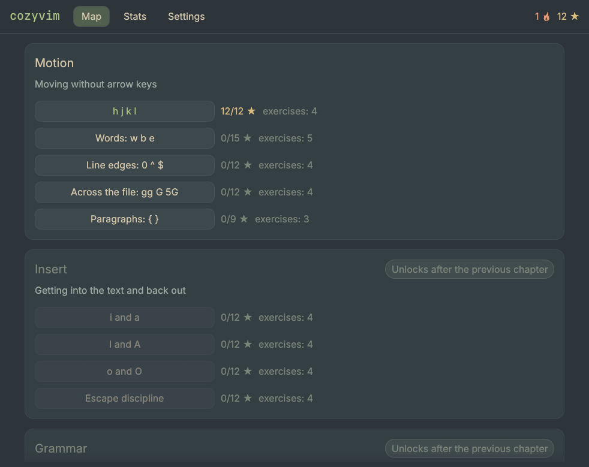

# cozyvim

Уютный десктопный тренажёр vim на Rust. Учит не списку команд, а грамматике:
оператор плюс движение. Слепая печать — следующий модуль, ядро под неё уже
разделено (метрики, экранная клавиатура, журнал событий переиспользуются).



## Запуск

```bash
cargo run --release
```

Тесты:

```bash
cargo test
```

Снимки экранов без окна (нужен GPU):

```bash
cargo run --example shots -- /куда/сохранить
```

## Как устроено

| Модуль | Что делает |
| --- | --- |
| `src/vim/` | Модальный интерпретатор: разбор нажатий в команды и их исполнение над буфером |
| `src/core/` | Буфер, нотация клавиш, оценка попытки, настройки, журнал, прогресс |
| `src/content/` | Загрузка уроков из встроенных TOML |
| `src/ui/` | Экраны, палитра Everforest, экранная клавиатура |
| `content/` | Сами уроки — правятся без знания Rust |
| `locales/` | Строки интерфейса (ru, en) |

Прогресс и настройки лежат в `~/.local/share/cozyvim/`
(`events.jsonl` — журнал попыток, `settings.json`). Переменная
`COZYVIM_DATA_DIR` меняет этот каталог.

## Режимы проверки

- **Микс** (по умолчанию) — засчитывается любой путь к цели, звёзды за
  оптимальность: 3★ за эталон, 2★ за ≤1.5× нажатий, 1★ за прохождение.
- **Строгий** — засчитывается только точная последовательность нажатий.
- **Свободный** — засчитывается любой путь, оптимум показывается справочно.

## Управление

Внутри упражнения **вся клавиатура принадлежит vim** — иначе тренажёр учил бы
неправильным рефлексам. Приложением управляют кнопки на панели и дубли:

| Действие | Клавиша |
| --- | --- |
| Подсказка | `F1` |
| Сброс упражнения | `F5` |
| Выход в меню | двойной `Esc` |

Команды вне реализованного подмножества (`:`, макросы, метки, `Ctrl-v`)
не считаются ошибкой — тренажёр честно говорит, что пока их не умеет.

## Как добавить урок

Создай файл в `content/chapters/<глава>/`:

```toml
id = "grammar/delete-word"
chapter = "grammar"
order = 10

[text.ru]
title = "Название урока"
intro = "Объяснение на пару абзацев"
[text.en]
title = "Lesson title"

[[exercise]]
buffer = ["let foo = 42;"]
cursor = [0, 4]
goal = ["let = 42;"]
solutions = ["dw", "daw"]
[exercise.text.ru]
task = "Что нужно сделать"
hint = "Подсказка"
[exercise.text.en]
task = "What to do"
```

Механика описывается один раз, тексты — секциями по языкам: перевод не может
разъехаться с логикой. Первое решение в `solutions` — то, которому учит урок
(его называет строгий режим), самое короткое — оптимум для звёзд.

Для уроков про движение результат — позиция курсора, а не текст:
добавь `goal_cursor = [строка, столбец]`, а `goal` оставь равным `buffer`.

`cargo test` прогоняет каждое решение каждого упражнения через движок и сверяет
с `goal` — битый урок не доживёт до пользователя.

## Что сделано и что дальше

Готовы все восемь глав — 36 уроков, 170 упражнений:

| Глава | Уроков | Упражнений | О чём |
| --- | --- | --- | --- |
| 1. Движение | 5 | 20 | `hjkl`, слова, края строки, прыжки по файлу, абзацы |
| 2. Вставка | 4 | 16 | `i a`, `I A`, `o O`, дисциплина Esc |
| 3. Грамматика | 5 | 22 | `d c y` плюс движение, построчные операции, счётчики |
| 4. Текстовые объекты | 5 | 27 | `iw aw`, кавычки, скобки, абзац |
| 5. Поиск и прыжки | 5 | 23 | `f t F T`, `; ,`, оператор с прицелом, `/ ? n N`, `*` |
| 6. Отмена и регистры | 5 | 23 | `u`, `Ctrl-r`, `p P`, именованные регистры, `.` |
| 7. Визуальный режим | 3 | 16 | `v` с движениями, `V` построчно, когда выделение окупается |
| 8. Мастерство | 4 | 23 | `r s S C J`, счётчики везде, переименование через `*` и `.` |

Метки (`m`), макросы (`q @`), `Ctrl-v` и `:`-команды движок пока не умеет, и
уроков про них нет: тренажёр честно говорит о них «пока не поддерживается»
вместо того, чтобы засчитывать ошибку.

Дальше: тест главы для перепрыгивания, модуль слепой печати (ЙЦУКЕН и таймер),
звук.
